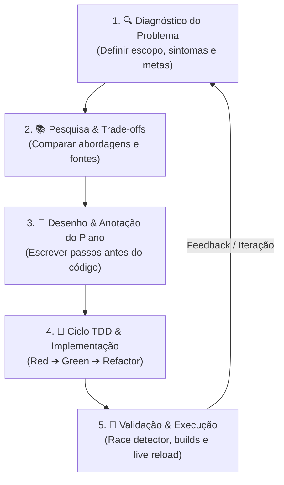

# Workflow de Desenvolvimento — OpsPulse

Este documento padroniza o ciclo contínuo de desenvolvimento, resolução de problemas e entrega do **OpsPulse**. O objetivo é garantir qualidade de código, previsibilidade arquitetural e velocidade de entrega sem retrabalho.

---

## O Ciclo de Engenharia em 5 Passos

Todo novo recurso, refatoração ou correção de bug deve seguir este fluxo antes e durante a escrita de código:



---

### Passo 1: Diagnóstico do Problema

- **O que precisa ser feito?** Defina claramente o problema ou a nova funcionalidade.
- **Quais são as restrições?** (Ex: performance, concorrência, compatibilidade com SSE, variáveis de ambiente).
- **Qual é o critério de sucesso?** O que determina que a tarefa foi concluída com êxito?

### Passo 2: Pesquisa & Comparação de Abordagens

- Avaliar diferentes padrões de projeto e ferramentas (ex: Actor Model vs Mutex, Air vs rebuild manual).
- Consultar documentações oficiais e referências da indústria (registradas em [`docs/web_sites_sources.md`](file:///home/smu/repositories-git/go-project/docs/web_sites_sources.md)).
- Ponderar prós, contras e complexidade de cada opção antes de tomar a decisão arquitetural.

### Passo 3: Desenho & Anotação do Plano

- **Não comece a codar diretamente.** Escreva um roteiro rápido (bullet points ou documento em `docs/steps/`) listando:
  - Arquivos que serão criados ou modificados.
  - Dependências e impactos em outros módulos.
  - Ordem lógica de execução.

### Passo 4: Ciclo TDD & Implementação (Red ➔ Green ➔ Refactor)

1. **Red (Vermelho):** Escreva ou ajuste o teste unitário/integração que descreve o comportamento esperado. O teste deve falhar inicialmente.
2. **Green (Verde):** Escreva o código mais simples e direto para fazer o teste passar.
3. **Refactor (Refatorar):** Limpe o código, elimine duplicações, melhore nomes de variáveis e garanta que os módulos continuem desacoplados.

### Passo 5: Validação Contínua & Execução

- Execute a suíte de testes com detector de race conditions:
  ```bash
  go test -v -race ./...
  ```
- Verifique se os binários compilam sem erros ou warnings:
  ```bash
  go build -o /dev/null ./cmd/api
  go build -o /dev/null ./cmd/opspulse
  ```
- Teste o comportamento em tempo de execução via containers / live reload.

---

## Inner Loop de Desenvolvimento (Hot-Reload com Air + Docker)

Para manter um ciclo de feedback instantâneo sem precisar reiniciar containers ou recompilar manualmente a cada alteração:

1. **Ambiente de Desenvolvimento (`deployments/compose.dev.yml`):**

   - Código montado via **Bind Mount** (`.:/app`) para refletir alterações em tempo real.
   - Binário do **Air** monitorando os diretórios `cmd/`, `internal/` e `web/`.
2. **Comandos Úteis de Desenvolvimento:**

   ```bash
   # Executar testes rápidos em todos os pacotes
   go test ./...

   # Executar testes com verificação de corrida de dados (Race Condition)
   go test -race ./...

   # Executar testes de um pacote específico com logs detalhados
   go test -v ./internal/api/
   go test -v ./internal/config/
   go test -v ./internal/checker/
   ```

---

## Diretrizes de Arquitetura & Qualidade

1. **Injeção Seletiva de Dependências:** Módulos e construtores devem receber apenas as structs de configuração que realmente utilizam (ex: `api.NewServer` recebe `ServerConfig` e `MonitorConfig`, nunca a config global inteira).
2. **Tratamento de Contexto & Graceful Shutdown:** Todas as rotinas em segundo plano e servidores HTTP devem respeitar `ctx.Done()` e encerrar recursos de forma segura com `sync.WaitGroup`.
3. **Logs Estruturados:** Utilizar sempre `log/slog` com atributos estruturados (`app`, `env`), respeitando as travas de segurança para produção.
4. **Sem Hardcoded Secrets / URLs:** Todas as portas, tokens, intervalos e arquivos de alvo devem ser parametrizados via variáveis de ambiente com fallbacks seguros.
