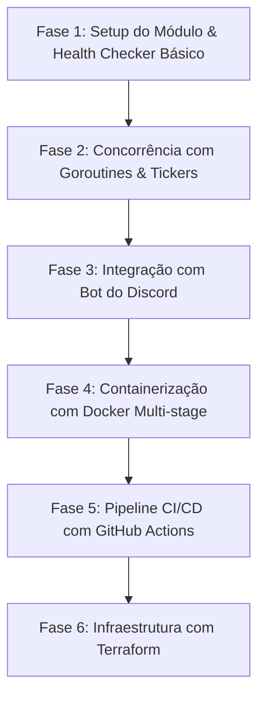

# OpsPulse — ChatOps & Health Check Bot em Go

> Um assistente de monitoramento e ChatOps desenvolvido em **Go**, projetado com foco em concorrência, boas práticas de arquitetura backend e esteira de automação **DevOps (Docker, GitHub Actions e Terraform)**.

---

## Objetivo & Filosofia do Projeto

Este projeto tem foco **didático e prático**. O objetivo principal não é criar um sistema complexo de uma vez só, mas sim **construir um MVP funcional do zero**, consolidando conceitos fundamentais de Go, padrões de arquitetura e práticas modernas de DevOps.

### Papel do Estudante e do Mentor

- **Você (Desenvolvedor):** Escreve o código, executa os comandos, resolve os desafios e aprende a debugar na prática.
- **Mentor (Antigravity):** Explica os conceitos por trás de cada linha, orienta sobre a estrutura idiomática do Go, dá feedbacks sobre boas práticas e sugere os próximos passos.

---

## MVP (Produto Mínimo Viável)

No MVP, o **OpsPulse** será capaz de:

1. **Verificar URLs:** Ler uma lista de endpoints/serviços configurados e testar a saúde de cada um via requisições HTTP periódicas.
2. **Concorrência Segura:** Usar _Goroutines_ e _Channels_ para checar múltiplos serviços em paralelo sem sobrecarregar a memória nem travar a aplicação.
3. **Notificações no Discord:**
   - Enviar alerta em um canal do Discord caso um serviço fique fora do ar (_DOWN_) ou volte a responder (_UP_).
   - Responder a um comando simples no Discord (ex: `/ping` ou `/status`) com a saúde atual dos serviços.
4. **DevOps Completo:**
   - Empacotamento em imagem Docker ultra-leve (Multi-stage build).
   - Pipeline de CI no **GitHub Actions** (Lint + Testes unitários automáticos).
   - Infraestrutura como Código (**Terraform**) para preparar a estrutura de deploy.

---

## Estrutura de Diretórios

```text
go-project/
├── cmd/
│   └── opspulse/           # Ponto de entrada da aplicação (função main.go)
│       └── main.go
├── internal/               # Código privado da aplicação (não exportado para terceiros)
│   ├── checker/            # Lógica de verificação de saúde de serviços HTTP
│   ├── discord/            # Cliente e manipuladores de eventos do Discord Bot
│   ├── config/             # Carregamento de variáveis de ambiente e configurações
│   └── models/             # Estruturas de dados (structs) compartilhadas
├── docs/                   # Documentação do projeto, guias e ideias
│   ├── ideas/              # Ideias de outros projetos para consulta futura
│   └── PROJECT_PLAN.md     # Este plano de projeto
├── scripts/                # Scripts auxiliares (ex: testes locais, setup)
├── terraform/              # Arquivos de infraestrutura como código
│   ├── main.tf
│   ├── variables.tf
│   └── outputs.tf
├── .github/
│   └── workflows/          # Pipelines de CI/CD (GitHub Actions)
│       └── ci.yml
├── .env.example            # Modelo de variáveis de ambiente
├── .gitignore
├── Dockerfile              # Imagem Docker multi-stage
├── docker-compose.yml      # Execução facilitada em ambiente local
├── go.mod                  # Módulo Go e dependências
└── README.md               # Apresentação do projeto
```

---

## Roadmap de Desenvolvimento por Fases

A evolução será dividida em etapas claras e incrementais:



---

### 🔹 Fase 1: Setup do Módulo & Health Checker Básico (Fundamentos)

- **Objetivo:** Inicializar o módulo Go, modelar os dados e criar uma função que faz requisições HTTP com timeout configurável.
- **Conceitos de Go a aprender:**
  - `go mod init` e gerenciamento de dependências.
  - Estruturas (`struct`), tipos primitivos e ponteiros básicos (`*`).
  - Pacote `net/http` e criação de `http.Client`.
  - Tratamento de erros idiomático (`if err != nil`).
  - Uso de `context.WithTimeout` para evitar chamadas HTTP presas indefinidamente.
- **Entregável da Fase:** Um programa simples que recebe uma URL e imprime no terminal o status (HTTP 200, tempo de resposta em ms, ou erro de conexão).

---

### 🔹 Fase 2: Concorrência & Monitoramento Contínuo (O Poder do Go)

- **Objetivo:** Monitorar uma lista de várias URLs periodicamente sem bloquear o fluxo.
- **Conceitos de Go a aprender:**
  - **Goroutines:** Executando funções de forma assíncrona com a palavra-chave `go`.
  - **Channels:** Comunicação e passagem de mensagens seguras entre goroutines.
  - **`time.Ticker`:** Disparo de tarefas em intervalos regulares (ex: a cada 30 segundos).
  - **`sync.WaitGroup`:** Sincronização e espera de tarefas paralelas terminarem.
- **Entregável da Fase:** Um monitor que roda em segundo plano e verifica 5 ou mais URLs em paralelo a cada X segundos, gerando logs estruturados.

---

### 🔹 Fase 3: Integração com o Discord Bot (ChatOps na Prática)

- **Objetivo:** Criar um bot no portal de desenvolvedores do Discord e integrá-lo ao Go via biblioteca `DiscordGo`.
- **Conceitos de Go a aprender:**
  - Gerenciamento de variáveis de ambiente com `os.Getenv` / `.env`.
  - Callbacks e manipuladores de eventos (`handlers`).
  - Envio de mensagens formatadas com **Embeds** (caixas com cores verde para UP, vermelho para DOWN).
  - Criação de um comando slash básico (ex: `/status`).
- **Entregável da Fase:** O bot envia alertas no canal sempre que uma URL monitorada cair ou voltar a responder, além de responder ao comando `/status`.

---

### 🔹 Fase 4: Docker & Otimização de Imagem (DevOps - Nível 1)

- **Objetivo:** Criar um `Dockerfile` multi-stage para compilar o binário de Go e gerar uma imagem mínima e segura.
- **Conceitos DevOps a aprender:**
  - Compilação estática (`CGO_ENABLED=0`).
  - Multi-stage build (estágio de build com `golang:alpine` e estágio final com `scratch` ou `alpine`).
  - `docker-compose.yml` para rodar a aplicação localmente de forma isolada.
- **Entregável da Fase:** Imagem Docker com menos de 25MB rodando a aplicação com segurança.

---

### 🔹 Fase 5: CI/CD com GitHub Actions (DevOps - Nível 2)

- **Objetivo:** Automatizar a verificação de qualidade a cada commit ou Pull Request.
- **Conceitos DevOps a aprender:**
  - Sintaxe de workflows do GitHub Actions (`.github/workflows/ci.yml`).
  - Execução de linters com `golangci-lint`.
  - Execução automática de testes unitários (`go test -v ./...`) e relatório de cobertura.
  - Build automatizado da imagem Docker.
- **Entregável da Fase:** Pipeline verde no GitHub validando código e testes a cada `git push`.

---

### 🔹 Fase 6: Infraestrutura como Código com Terraform (DevOps - Nível 3)

- **Objetivo:** Declarar a infraestrutura necessária de forma automatizada e reproduzível.
- **Conceitos DevOps a aprender:**
  - Sintaxe HCL do Terraform (`main.tf`, `variables.tf`, `outputs.tf`).
  - Gerenciamento de estado (`terraform.tfstate`).
  - Provisionamento de uma máquina ou serviço em nuvem para hospedar o bot (ou uso do LocalStack para não gerar custos).
- **Entregável da Fase:** Comandos `terraform plan` e `terraform apply` provisionando o ambiente com sucesso.
