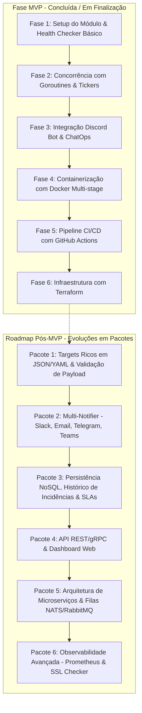

# 📡 OpsPulse — ChatOps & Health Check Bot em Go

> Um assistente de monitoramento e ChatOps desenvolvido em **Go**, projetado com foco em concorrência, boas práticas de arquitetura backend e esteira de automação **DevOps (Docker, GitHub Actions e Terraform)**.

---

## 🎯 Objetivo & Filosofia do Projeto

Este projeto tem foco **didático e prático**. O objetivo principal não é criar um sistema complexo de uma vez só, mas sim **construir um MVP funcional do zero** e evoluir em **fases e pacotes modulares incrementais**, consolidando conceitos fundamentais de Go, padrões de arquitetura (SOLID, Go Idioms) e práticas modernas de DevOps.

### 👨‍💻 Papel do Desenvolvedor e do Mentor

- **Você (Desenvolvedor):** Escreve o código, executa os comandos, resolve os desafios de arquitetura e aprende a debugar na prática.
- **Mentor (Antigravity):** Explica os conceitos por trás de cada linha, orienta sobre a estrutura idiomática do Go, dá feedbacks sobre boas práticas e sugere os próximos passos.

---

## 🏗️ MVP (Produto Mínimo Viável) — _[Concluído]_

No MVP, o **OpsPulse** entrega:

1. **Verificação Concorrente de URLs:** Motor HTTP em Go com goroutines, channels com buffer, `sync.WaitGroup` e context timeouts.
2. **Ciclo Contínuo & Graceful Shutdown:** Loop de monitoramento com `time.NewTicker`, canal de gatilho/trigger sob demanda e encerramento seguro com `signal.NotifyContext`.
3. **Observabilidade & Logging Estruturado:** Pacote de log com `log/slog` nativo, múltiplos handlers (Text/JSON), `io.MultiWriter` para terminal e arquivo de log diário com rotação na pasta `log/`.
4. **ChatOps com Discord:**
   - Notificações automáticas em canais com Discord Embeds visuais (cores verde para UP e vermelho para DOWN).
   - Comandos Slash (`/status`) e Botões Interativos (🔄 "Checar Novamente") via WebSocket Gateway oficial (`discordgo`).
   - Interface desacoplada `Notifier` baseada em Inversão de Dependência (SOLID).
5. **Automação DevOps:**
   - `Dockerfile` multi-stage gerando uma imagem final ultra-leve (< 20MB) baseada em Alpine.
   - `compose.yml` para orquestração local com volumes de logs e `.env`.
   - CI/CD no **GitHub Actions** (`.github/workflows/ci.yml`) com lint, testes unitários de cobertura, race detector e release de binários multi-plataforma (Linux e Windows).

---

## 📂 Estrutura de Diretórios Atual (Monolito Modular)

```text
go-project/
├── cmd/
│   └── opspulse/           # Ponto de entrada da aplicação (função main.go)
│       └── main.go
├── internal/               # Código privado da aplicação (encapsulado e protegido)
│   ├── checker/            # Motor de checagem concorrente, agendamento e interface Notifier
│   ├── discord/            # Cliente, Embeds, Handlers de Slash Commands e Botões Interativos
│   ├── config/             # Carregamento de variáveis de ambiente com fallbacks e validações
│   ├── logger/             # Setup de logs estruturados com slog e arquivos diários
│   ├── context/            # Helpers de ciclo de vida e graceful shutdown
│   └── errs/               # Erros sentinela centrais do domínio
├── docs/                   # Documentação do projeto, guias e ideias
│   ├── ideas/              # Ideias de outros projetos para consulta futura
│   └── PROJECT_PLAN.md     # Este plano de projeto e roadmap
├── log/                    # Arquivos de log de runtime gerados (ignorado no Git)
├── terraform/              # Infraestrutura como Código (AWS/Cloud Provisioning)
│   ├── main.tf
│   ├── variables.tf
│   └── outputs.tf
├── .github/
│   └── workflows/          # Pipelines de CI/CD (GitHub Actions)
│       └── ci.yml
├── .dockerignore
├── .env.example
├── .gitignore
├── Dockerfile              # Imagem Docker multi-stage otimizada
├── compose.yml             # Execução facilitada em ambiente local
├── go.mod                  # Módulo Go e dependências
└── README.md               # Apresentação do projeto
```

---

## 🗺️ Roadmap de Desenvolvimento por Fases



---

## 🚀 Fases do MVP (Passo a Passo)

- [x] **Fase 1: Setup do Módulo & Health Checker Básico**
  - Módulo Go, Structs de dados tipadas (`CheckResult`), requisições HTTP seguras com `net/http` e timeouts.
- [x] **Fase 2: Concorrência & Monitoramento Contínuo**
  - Fan-out/fan-in com goroutines, channels, `sync.WaitGroup`, loop com `time.NewTicker`, canal `triggerChan` e graceful shutdown com `signal.NotifyContext`.
- [x] **Fase 3: Integração com Discord Bot & ChatOps**
  - Sessão WebSocket persistente via `discordgo`, envio de Discord Embeds estilizados, registro de Slash Commands (`/status`) e Botões Interativos (🔄 "Checar Novamente").
- [x] **Fase 4: Docker & Otimização de Imagem**
  - `Dockerfile` multi-stage reduzindo imagem para < 20MB, `.dockerignore`, `compose.yml` com mapeamento de volume para `./log`.
- [x] **Fase 5: CI/CD com GitHub Actions**
  - Pipeline `.github/workflows/ci.yml` automatizando testes unitários, race detector, linters e geração de releases multi-plataforma.
- [ ] **Fase 6: Infraestrutura como Código com Terraform** _(Em andamento)_
  - Declaração de infraestrutura em nuvem (AWS/LocalStack), Security Groups, Instância e inicialização automatizada com User Data.

---

## 🔮 Roadmap Pós-MVP (Evoluções & Atualizações Futuras)

As melhorias futuras serão implementadas em **pacotes de atualização independentes**, permitindo evoluir a arquitetura sem quebrar o que já está funcionando:

---

### 📦 Pacote 1: Gestão Rica de Targets (JSON / YAML & Validação de Payload)

- **Objetivo:** Permitir configurações avançadas por endpoint sem depender apenas de strings simples no `.env`.
- **Novas Funcionalidades:**
  - Arquivo `targets.json` ou `targets.yaml` com suporte a:
    - **Códigos HTTP esperados customizados:** ex: `expected_statuses: [200, 201, 204]`.
    - **Métodos HTTP variados:** `GET`, `POST`, `PUT`, `HEAD`.
    - **Headers customizados:** envio de headers de autenticação (`Authorization: Bearer ...`), `User-Agent` personalizado, etc.
    - **Validação de Body/Payload:** checar se a resposta contém uma string específica, um JSON válido ou atende a uma expressão regular (Regex).
    - **Timeouts e intervalos individuais por serviço.**

---

### 📦 Pacote 2: Plataforma Multi-Notificadores (Design Pattern: Factory & Strategy)

- **Objetivo:** Expandir a interface `Notifier` para que o OpsPulse envie alertas para múltiplos canais simultaneamente.
- **Novas Integrações:**
  - **Slack:** Webhooks de entrada e bot com formatação rica via _Slack Block Kit_.
  - **Email:** Envio de relatórios detalhados via SMTP, AWS SES ou Resend.
  - **Telegram:** Bot para alertas diretos em grupos e chats privados.
  - **Microsoft Teams:** Webhooks integrados para ambientes corporativos.
- **Padrões de Projeto Aplicados:**
  - **Factory Pattern:** Criação dinâmica dos notificadores habilitados na configuração.
  - **Composite Notifier:** Um despachante que distribui o mesmo alerta para Discord + Slack + Email em paralelo.

---

### 📦 Pacote 3: Persistência NoSQL, Histórico de Incidentes & Métricas de SLA

- **Objetivo:** Guardar o histórico de disponibilidade para gerar relatórios e evitar falsos positivos.
- **Novas Funcionalidades:**
  - **Banco NoSQL / Time-Series (MongoDB, Redis ou SQLite/Postgres):** Gravação de cada checagem com timestamp, latência e status.
  - **Gestão de Incidentes:** Registro automático de quando um serviço caiu, tempo total de downtime e momento exato da recuperação.
  - **Cálculo de SLA/Uptime:** Exibir métricas de disponibilidade (ex: _Uptime dos últimos 30 dias: 99.95%_).
  - **Threshold de Alertas (Alert Flapping Prevention):** Só disparar alerta após $N$ falhas consecutivas (ex: 3 falhas seguidas), evitando notificações por instabilidades momentâneas de rede.

---

### 📦 Pacote 4: API REST / gRPC & Dashboard Web

- **Objetivo:** Gerenciar o monitoramento dinamicamente em tempo de execução via interface visual e API.
- **Novas Funcionalidades:**
  - **API REST / gRPC (com Chi ou Fiber):**
    - `POST /api/v1/targets` — Cadastrar novas URLs para monitorar sem reiniciar a aplicação.
    - `GET /api/v1/status` — Consultar status de todos os serviços em tempo real via JSON.
    - `GET /api/v1/incidents` — Histórico de quedas e alertas.
  - **Web Dashboard Minimalista:** Interface gráfica (HTML/HTMX ou Tailwind) com gráficos de latência, uptime e botões de ação rápida.

---

### 📦 Pacote 5: Evolução para Arquitetura de Microserviços & Mensageria

- **Objetivo:** Escalar a aplicação desacoplando o motor de checagem dos serviços de notificação.
- **Novas Funcionalidades:**
  - **Mensageria Assíncrona (NATS, RabbitMQ ou Redis Pub/Sub):**
    - Microserviço 1: **OpsPulse-Worker (Core):** Só executa checagens HTTP de alta performance e publica eventos em tópicos (`service.down`, `service.up`).
    - Microserviço 2: **OpsPulse-Notifier:** Consome a fila e despacha para Discord, Slack e Email de forma resiliente com retries automáticos.
    - Microserviço 3: **OpsPulse-API:** Interface de gerenciamento e API pública.

---

### 📦 Pacote 6: Observabilidade Avançada & SSL Expiration Watchdog

- **Objetivo:** Monitoramento profundo e integração com ecossistema de observabilidade padrão da indústria.
- **Novas Funcionalidades:**
  - **Métricas Prometheus (`/metrics`):** Exportação de métricas nativas (latência por serviço, taxa de erros, número de goroutines ativas) prontas para dashboards no **Grafana**.
  - **SSL/TLS Certificate Expiration Checker:** Checagem automática da data de expiração dos certificados HTTPS dos serviços, enviando alerta no Discord com 30, 15 e 7 dias de antecedência antes do certificado expirar.
  - **Health Check de Portas TCP & Bancos de Dados:** Checagem de portas raw (Redis, PostgreSQL, MySQL) além de HTTP.
