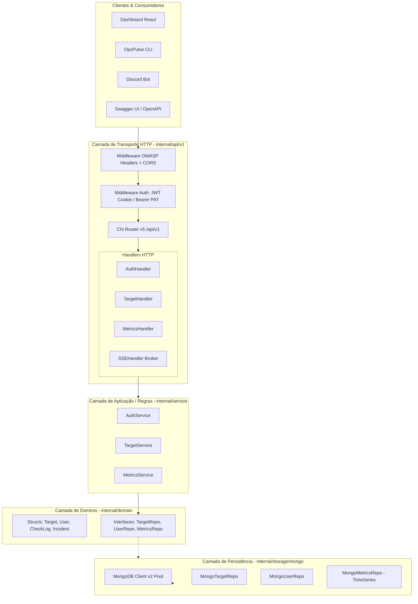

# 🏗️ Plano de Arquitetura & Implementação: API REST v2 (OpsPulse)

## 🎯 1. Visão Geral & Objetivos

A versão 2 da API do **OpsPulse** evolui a prova de conceito inicial baseada em arquivos (`targets.json`) para uma arquitetura robusta, persistente e pronta para produção. O objetivo é fornecer uma API escalável, documentada via OpenAPI/Swagger, segura por padrão (OWASP) e fundamentada em uma **Arquitetura Pragmática em Go**.

---

## 🏛️ 2. Arquitetura Pragmática em Go (Clean sem Burocracia)

Adotamos a **Arquitetura Pragmática em Go**: direta ao ponto, com separação clara de responsabilidades, alta testabilidade via interfaces e sem excesso de camadas ou DTOs desnecessários.



### 📁 Estrutura de Diretórios Proposta

```text
internal/
├── domain/                  # Entidades puras e contratos de repositório (sem dependências externas)
│   ├── target.go            # Struct Target + interface TargetRepository
│   ├── user.go              # Struct User + interface UserRepository
│   ├── metric.go            # Struct CheckLog + interface MetricsRepository
│   └── errors.go            # Erros de domínio centrais
│
├── service/                 # Regras de negócio e orquestração de casos de uso
│   ├── target_service.go
│   ├── auth_service.go
│   └── metrics_service.go
│
├── storage/                 # Implementações concretas de banco de dados
│   └── mongo/
│       ├── client.go        # Inicialização do driver oficial v2 com connection pooling
│       ├── indexes.go       # Garantia e migração de índices e coleções time-series
│       ├── target_repo.go
│       ├── user_repo.go
│       └── metrics_repo.go
│
└── api/
    ├── routes.go        # Sub-roteador Chi para /api/v1
    ├── handler_auth.go
    ├── handler_target.go
    ├── handler_metrics.go
    ├── handler_sse.go
    │
    ├── middleware_security.go  # OWASP Secure Headers
    ├── middleware_cors.go      # Políticas de CORS seguras
    └── middleware_auth.go      # Validação de JWT e API Keys
```

---

## 🗄️ 3. Banco de Dados: MongoDB & Estratégia PACELC

O MongoDB foi escolhido como solução NoSQL orientada a documentos por se alinhar aos requisitos de schema flexível e alta performance em séries temporais.

### ⚖️ O Teorema PACELC no OpsPulse:

* **Sob Particionamento (P):** Priorizamos **Consistência (C)** para alvos e usuários (`WriteConcern: majority`). Nenhuma alteração de alvo pode ser dada como concluída sem confirmação da maioria dos nós.
* **Em Operação Normal (E):** Para métricas e pings periódicos (`check_logs`), priorizamos **Latência Baixa (L)** (`WriteConcern: 1` ou unacknowledged em lote assíncrono), garantindo que pings em alta frequência não engargalem a CPU nem saturem o pool de conexões.

### 📊 Modelagem das Coleções

1. **`users` (Coleção Documental Padrão):**

   * `_id` (`primitive.ObjectID`)
   * `github_id` (`string`, índice único)
   * `username` (`string`)
   * `email` (`string`)
   * `avatar_url` (`string`)
   * `api_keys` (`[]APIKey`: hash SHA-256, nome, criado em, último uso)
   * `created_at`, `updated_at`
2. **`targets` (Coleção Documental Padrão):**

   * `_id` (`primitive.ObjectID`)
   * `user_id` (`primitive.ObjectID`, índice)
   * `name` (`string`)
   * `url` (`string`, índice composto com `user_id`)
   * `method` (`string`: GET, POST, HEAD)
   * `interval_seconds` (`int`)
   * `timeout_seconds` (`int`)
   * `expected_status` (`[]int`)
   * `headers` (`map[string]string`, flexível)
   * `enabled` (`bool`)
   * `created_at`, `updated_at`
3. **`check_logs` (Coleção Nativa Time-Series - MongoDB 5.0+):**

   * Criada explicitamente como coleção temporal:
     ```javascript
     db.createCollection("check_logs", {
       timeseries: {
         timeField: "checked_at",
         metaField: "target_id",
         granularity: "seconds"
       }
     })
     ```
   * **Campos:** `target_id`, `checked_at`, `status_code`, `latency_ms`, `is_up`, `error_message`.
   * **Índice TTL:** Expiração automática de registros mais antigos que 30 dias (`expireAfterSeconds: 2592000`).

---

## 🔐 4. Autenticação & Autorização (Sem Gerenciamento de Senhas)

Para eliminar os riscos de vazamento de credenciais e a complexidade de gerenciar senhas, adotamos autenticação **delegada e sem senha**:

### A. Para Humanos (Dashboard Web React):

* **Provedor:** OAuth 2.0 via **GitHub**.
* **Fluxo:**
  1. Frontend redireciona para `GET /api/v1/auth/github`.
  2. Backend redireciona para o consentimento do GitHub (`oauth2.Config`).
  3. GitHub retorna para o callback `GET /api/v1/auth/github/callback?code=...`.
  4. Backend valida o código, cria/atualiza o usuário na coleção `users`.
  5. Backend gera um **JWT de Sessão** e o injeta em um **Cookie HTTP-Only** (`SameSite=Lax`, `Secure` em prod).
  6. O frontend não manipula o token diretamente no `localStorage` (mitigando ataques XSS).

### B. Para Automações & Agentes (CLI, Bot Discord, Scripts):

* **Mecanismo:** **Personal Access Tokens (PAT) / API Keys**.
* O usuário gera uma chave no dashboard (ex: `op_live_abc123...`).
* O banco grava apenas o hash `SHA-256(token)`.
* As requisições utilizam o header padrão: `Authorization: Bearer op_live_...`.

---

## 🛡️ 5. Segurança de Aplicação (OWASP) & Estratégia de Nuvem

### A. Proteções em Nível de Código (Backend Go):

Implementaremos middlewares dedicados para garantir conformidade com as diretrizes do **OWASP Secure Headers Project**:

* **Middleware de Headers Seguros:**
  * `X-Content-Type-Options: nosniff` (impede MIME-sniffing).
  * `X-Frame-Options: DENY` (previne clickjacking).
  * `Strict-Transport-Security: max-age=63072000; includeSubDomains; preload` (HSTS forçado em produção).
  * `Content-Security-Policy: default-src 'self'` (ou adaptado caso sirva Swagger UI).
  * `Referrer-Policy: strict-origin-when-cross-origin`.
  * `Permissions-Policy: camera=(), microphone=(), geolocation=()`.
* **CORS Restritivo (`go-chi/cors`):**
  * Origem permitida estrita: `http://localhost:5173` (dev) ou domínio oficial (prod).
  * `AllowCredentials: true` (essencial para cookies HTTP-Only de sessão).
  * Métodos e headers explicitamente limitados.
* **Sanitização de Entradas:** Limitação de payload de requisições (`http.MaxBytesReader`) para mitigar negação de serviço por payloads gigantes.

---

> [!NOTE]
> ### ☁️ Lembrete de Arquitetura: Proteções Delegadas à Nuvem
>
> As seguintes camadas de defesa de borda não serão construídas no código Go para evitar reinventar a roda, sendo postergadas para a fase de **Infraestrutura / Cloud (Terraform)**:
>
> 1. **WAF (Web Application Firewall):** Filtragem de SQLi, NoSQL Injection na borda e payloads maliciosos (via Cloudflare / AWS WAF).
> 2. **Rate Limiting Distribuído & Proteção DDoS:** Mitigação de flood de requisições em nível de IP ou rota na CDN/Edge.
> 3. **Firewall & Isolamento de Rede:** Subnets privadas para o MongoDB, Security Groups fechados e certificados TLS/HTTPS automáticos.

---

## 📖 6. Contratos e Documentação: OpenAPI & Swagger (v)

A API terá documentação viva e interativa utilizando o padrão **OpenAPI 3.1 / Swagger**:

* **Geração via Código com `apisec`:**
  * https://github.com/ehabterra/apispec
* **Rotas de Documentação Servidas pelo Chi:**
  * `GET /docs/openapi.yaml` (Especificação OpenAPI).
  * `GET /docs/*` (Interface interativa Swagger UI).
* **Automação no Makefile:** Comando `make api-docs` para regenerar a especificação automaticamente sempre que um handler for alterado.

---

## 🗺️ 7. Roteiro de Execução Passo a Passo (Etapas Incrementais)

```text
┌────────────────────────────────────────────────────────────────────────┐
│ PASSO 1: Persistência Base & MongoDB Driver v2                         │
│  - Docker Compose com MongoDB + inicialização do client Go com pool    │
│  - Criação da coleção Time-Series check_logs e índices automáticos     │
├────────────────────────────────────────────────────────────────────────┤
│ PASSO 2: Middlewares de Segurança OWASP & CORS                         │
│  - Headers de proteção (nosniff, frame-options, csp)                   │
│  - Configuração fina de CORS com suporte a cookies                     │
├────────────────────────────────────────────────────────────────────────┤
│ PASSO 3: Autenticação GitHub OAuth 2.0 & Sessão JWT                    │
│  - Rotas /api/v1/auth/github e /callback                               │
│  - Emissão de Cookie HTTP-Only e middleware de autenticação            │
├────────────────────────────────────────────────────────────────────────┤
│ PASSO 4: Refatoração em Camadas do CRUD de Targets                     │
│  - Domain (Target) -> MongoTargetRepo -> TargetService -> Handlers     │
│  - Substituição do targets.json estático pela coleção do MongoDB       │
├────────────────────────────────────────────────────────────────────────┤
│ PASSO 5: Integração do Checker & Broker SSE com o Banco                │
│  - Checker grava pings na coleção Time-Series check_logs               │
│  - SSE Broker continua enviando atualizações em tempo real ao front    │
├────────────────────────────────────────────────────────────────────────┤
│ PASSO 6: OpenAPI / Swagger UI & Testes de Integração                   │
│  - Anotações Swagger nos handlers e rota interativa (v)                │
│  - Testes com banco real via containers de teste ou compose            │
└────────────────────────────────────────────────────────────────────────┘
```

---

## 🏁 Critérios de Sucesso da Versão 2

1. **Persistência Dinâmica:** Cadastro, edição e remoção de alvos pelo dashboard refletidos instantaneamente no MongoDB sem reiniciar binários.
2. **Zero Senhas:** Login com 1 clique via GitHub e geração de API Keys seguras para integrações.
3. **Métricas Temporais Eficientes:** Histórico de pings gravado na coleção Time-Series com expiração de 30 dias via índice TTL.
4. **Conformidade de Segurança:** Classificação A+ em scanners de headers HTTP (SecurityHeaders.com) e autenticação blindada contra XSS/CSRF.
5. **Documentação Acessível:** Todos os endpoints testáveis diretamente pela interface do Swagger UI.
