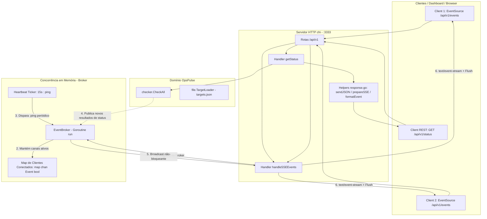

# 🏗️ Plano de Implementação: Módulo de API REST & Streaming SSE com Broker Pub/Sub

## 🎯 Objetivo

Construir a API REST do **OpsPulse** em Go (`internal/api` e `cmd/api`), incluindo suporte a streaming de relatórios de saúde em tempo real utilizando o padrão **Server-Sent Events (SSE)** com arquitetura de concorrência **Pub/Sub Broker** e **Graceful Shutdown**.

---

## 🏛️ Desenho de Arquitetura do Módulo de API & SSE



---

## 🗺️ Roteiro de Execução Passo a Passo (Etapas Incrementais)

A execução será dividida em **5 passos independentes e testáveis**:

```text
┌────────────────────────────────────────────────────────────────────────┐
│ PASSO 1: Formatação de Eventos SSE (events.go e response.go)           │
├────────────────────────────────────────────────────────────────────────┤
│ PASSO 2: Refinamento do EventBroker (broker.go com broadcast de Event)  │
├────────────────────────────────────────────────────────────────────────┤
│ PASSO 3: Handler SSE com http.Flusher e Context Cancellation           │
├────────────────────────────────────────────────────────────────────────┤
│ PASSO 4: Injeção do Broker no Server & Rota /api/v1/events             │
├────────────────────────────────────────────────────────────────────────┤
│ PASSO 5: Testes Unitários com httptest e Validação com curl / Browser  │
└────────────────────────────────────────────────────────────────────────┘
```

---

### 🔹 Passo 1: Modelagem e Formatação de Eventos SSE

#### O que fazer:

1. **No `internal/api/events.go`:**
   * Modelar a struct `Event`:
     * `ID` (string): Identificador sequencial do evento (opcional).
     * `Name` (string): Nome do evento (ex: `"status"`, `"alert"`, `"heartbeat"`).
     * `Data` (any): Carga útil do evento (ex: `[]checker.CheckResult`).
     * `Retry` (int): Tempo em milissegundos para instruir o navegador a reconectar se a rede cair (ex: `5000`).
2. **No `internal/api/response.go`:**
   * Implementar `formatEvent(e Event) []byte`:
     * Formata os bytes no protocolo W3C:
       ```text
       event: status\n
       data: {"url":"https://github.com","is_up":true}\n
       retry: 5000\n\n
       ```
   * Manter o helper `prepareSSE(w http.ResponseWriter) (http.Flusher, bool)` já iniciado.

---

### 🔹 Passo 2: O Motor de Concorrência `EventBroker` (`broker.go`)

#### O que fazer:

1. Refinar a struct `EventBroker`:
   * `clients: map[chan Event]bool` (conjunto de canais ativos).
   * `register: chan chan Event` (canal para novos clientes conectando).
   * `unregister: chan chan Event` (canal para clientes desconectando).
   * `publish: chan Event` (canal para receber novos eventos a transmitir).
2. O loop central `run()` (Actor Goroutine):
   * Processa registros e remoções de forma 100% thread-safe em uma única goroutine.
   * `Publish(e Event)`: Envia o evento no canal `publish` de forma assíncrona.
   * Fechamento seguro de canais ao desconectar clientes.

---

### 🔹 Passo 3: O Handler SSE de Streaming (`handlers.go`)

#### O que fazer:

1. Criar o método `(s *Server) handleSSE(w http.ResponseWriter, r *http.Request)`:
   * Chama `prepareSSE(w)`. Se falhar (cliente não suporta streaming), retorna erro.
   * Cria um canal individual para a conexão HTTP atual: `clientChan := make(chan Event, 10)`.
   * Registra no broker: `s.broker.Register(clientChan)`.
   * Registra a saída com `defer s.broker.Unregister(clientChan)`.
   * **Loop de streaming com `select`:**
     * `case <-r.Context().Done()`: O cliente fechou a aba do navegador $\rightarrow$ encerra o handler.
     * `case event := <-clientChan`: Recebeu evento do Broker $\rightarrow$ formata e envia com `flusher.Flush()`.

---

### 🔹 Passo 4: Conexão no `Server`, Rotas e Heartbeat

#### O que fazer:

1. No `internal/api/server.go`:
   * Adicionar o `broker *EventBroker` como campo do `Server`.
   * Instanciar `broker := NewEventBroker()` no `NewServer`.
2. No `internal/api/routes.go`:
   * Registrar a rota SSE: `r.Get("/events", s.handleSSE)`.
3. Iniciar um Ticker de Heartbeat em segundo plano (a cada 20s) enviando `: ping\n\n` para evitar timeout de proxies reversos.

---

### 🔹 Passo 5: Testes Automatizados & Verificação Manual

#### Testes Automatizados:

* `TestFormatEvent`: Validar que a struct `Event` é serializada exatamente no padrão `event: ...\ndata: ...\n\n`.
* `TestBroker_Publish`: Validar que múltiplos clientes recebem o mesmo evento transmitido.
* `TestSSE_Handler`: Validar com `httptest.NewServer` que a rota `/api/v1/events` responde com `Content-Type: text/event-stream` e faz streaming dos dados.

#### Verificação Manual:

* Teste com `curl`:
  ```bash
  curl -N -H "Accept: text/event-stream" http://localhost:3333/api/v1/events
  ```
* Teste no navegador com `EventSource` no console do DevTools:
  ```javascript
  const es = new EventSource("http://localhost:3333/api/v1/events");
  es.onmessage = (e) => console.log("Evento SSE recebido:", JSON.parse(e.data));
  ```
