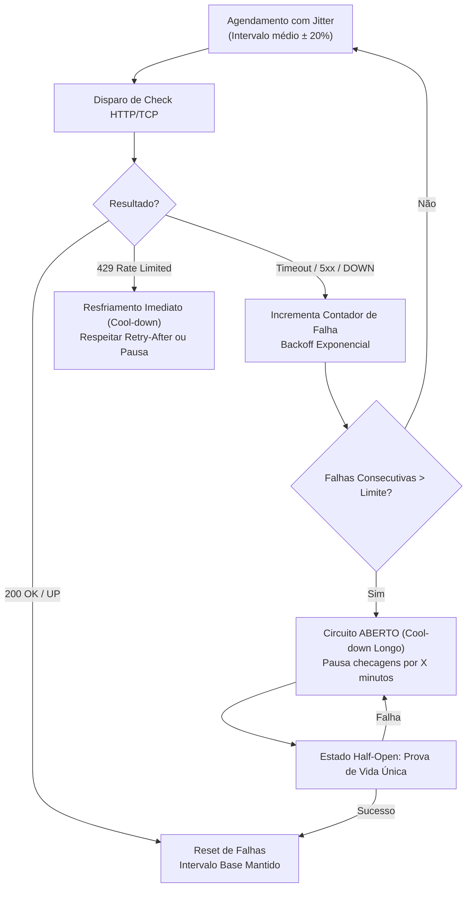

# 🛡️ Plano de Engenharia & Resiliência: Motor de Monitoramento (App / Checker)

## 🎯 1. Visão Geral & Motivação

O **OpsPulse** possui como núcleo o motor de monitoramento de alvos (`cmd/opspulse` e `internal/checker`). Em cenários de produção e redes reais, um monitor ingênuo que apenas dispara loops fixos (`time.NewTicker`) enfrenta problemas críticos:

1. **Thundering Herd (Efeito Manada):** Disparar dezenas ou centenas de requisições concorrentes exatamente no mesmo milissegundo gera picos artificiais de CPU, sockets de rede e I/O, além de se comportar como um ataque DoS contra os alvos.
2. **Amplificação de Queda:** Se um serviço caiu por sobrecarga de banco de dados, o monitor que continua batendo nele em intervalos curtos piora a indisponibilidade e impede sua recuperação.
3. **Bloqueio por Rate Limiting (HTTP 429):** Servidores com WAF (Cloudflare, AWS WAF, Nginx) bloqueiam e banem o IP do monitor se ele insistir em fazer requisições após receber status 429 (*Too Many Requests*).

Para resolver esses desafios mantendo a **Arquitetura Pragmática em Go**, definimos as estratégias de **Jitter**, **Exponential Backoff** e **Circuit Breaker / Cool-down**.

---

## 🏛️ 2. Padrões de Projeto Selecionados (Sem Burocracia)



---

## 📋 3. Especificação dos Mecanismos

### A. Jitter Aleatório (Distribuição Estocástica)
- **Conceito:** O parâmetro `interval` deixa de ser um relógio rígido e passa a ser uma **média**.
- **Regra:** Adiciona uma variação aleatória de $\pm 20\%$ no intervalo de cada serviço:
  $$\text{Intervalo Efetivo} = \text{Intervalo Base} \pm \text{Random}(0, 0.2 \times \text{Intervalo Base})$$
- **Benefício:** Desfaz a sincronização das requisições, espalhando os pings de forma homogênea no tempo.

---

### B. Backoff Exponencial & Tratamento de Rate Limiting (429)
- **Conceito:** Quando o serviço falha ou responde com *429 Too Many Requests*, aumentamos progressivamente o tempo até o próximo teste.
- **Regras:**
  - **Falha Consecutiva:** Cada falha dobra o tempo de espera ($2 \times \text{intervalo}$), limitado a um teto máximo (ex: 5 minutos).
  - **HTTP 429:**
    - Se o alvo responder com header `Retry-After`, o monitor agenda a próxima checagem para o tempo indicado.
    - Caso contrário, aplica cool-down fixo (ex: 60 segundos) para evitar banimento do IP do monitor.

---

### C. Circuit Breaker / Cool-down Minimalista por Alvo
- **Conceito:** Evita martelar serviços que comprovadamente caíram.
- **Estados do Alvo:**
  1. **CLOSED (Normal):** Alvo saudável. Monitora no ritmo padrão com jitter.
  2. **OPEN (Em Quarentena / Resfriamento):** Após $N$ falhas consecutivas (ex: 3 a 5 falhas), o circuito abre. O monitor pausa os pings regulares e aguarda um intervalo de resfriamento maior (ex: 2 a 5 minutos).
  3. **HALF-OPEN (Sonda de Teste):** Após expirar a quarentena, envia uma única requisição de teste ("canary probe"):
     - Se responder saudável: fecha o circuito e restabelece a frequência normal.
     - Se falhar: reabre o circuito e reinicia a quarentena.

---

## 🗺️ 4. Roteiro Passo a Passo de Implementação (Incrementos)

```text
┌────────────────────────────────────────────────────────────────────────┐
│ PASSO 1: Função Auxiliar de Jitter no Pacote checker                   │
│  - Adicionar cálculo de jitter estocástico sem dependências externas   │
├────────────────────────────────────────────────────────────────────────┤
│ PASSO 2: Controle de Estado por Target (HealthState / CircuitState)    │
│  - Struct interna para rastrear falhas consecutivas e nextCheckAt      │
├────────────────────────────────────────────────────────────────────────┤
│ PASSO 3: Tratamento de HTTP 429 e Leitura do Header Retry-After        │
│  - Pausa imediata de requisições ao alvo com alerta apropriado         │
├────────────────────────────────────────────────────────────────────────┤
│ PASSO 4: Loop Adaptativo em StartMonitoring                            │
│  - Checagem individualizada respeitando nextCheckAt de cada serviço    │
├────────────────────────────────────────────────────────────────────────┤
│ PASSO 5: Testes Unitários com Mocks e Simulações de Falha              │
│  - Validar que o intervalo é dilatado durante falhas e volta ao normal │
└────────────────────────────────────────────────────────────────────────┘
```

---

## 💡 5. Diretriz de Simplicidade (Evitar Complexidade Prematura)

> [!TIP]
> **Mantenha Simples:** Não é necessário importar frameworks pesados de Circuit Breaker. Em Go, isso pode ser implementado com uma `struct` simples contendo:
> - `ConsecutiveFailures int`
> - `NextCheckAt time.Time`
> - `State (Closed, Open, HalfOpen)`
> 
> Isso garante performance máxima, zero dependências extras e código fácil de manter e testar.

