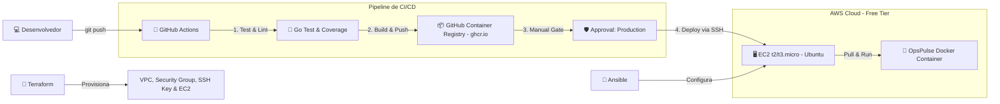

# 🚀 Plano de Provisionamento de Infraestrutura & Deploy (AWS + Terraform + Ansible + CI/CD)

> Guia passo a passo para provisionar uma instância EC2 (Free Tier) na AWS via Terraform, configurá-la com Ansible e criar o pipeline de CI/CD com GitHub Actions para deploy contínuo do OpsPulse.

---

## 🏗️ Arquitetura da Solução



---

## 🗺️ Roteiro de Execução por Fases

---

### 🔹 Fase 1: Conta AWS, Segurança de IAM & CLI

1. **Criação da Conta AWS:**
   - Ativação obrigatória de **MFA (Multi-Factor Authentication)** no usuário Root.
   - Configuração de alertas de faturamento (_AWS Budgets_) para alertar se houver qualquer custo acima de \$0.01.

2. **Criação de Usuário de Serviço (IAM):**
   - Criar usuário programático com permissões estritas para provisionamento (ex: `AmazonEC2FullAccess`, `AmazonVPCFullAccess`).
   - Gerar par de chaves de acesso (`AWS_ACCESS_KEY_ID` e `AWS_SECRET_ACCESS_KEY`).

3. **Configuração Local:**
   - Instalar e configurar o **AWS CLI**:
     ```bash
     aws configure
     ```
   - Validar autenticação: `aws sts get-caller-identity`.

---

### 🔹 Fase 2: Chave SSH & Infraestrutura com Terraform

1. **Par de Chaves SSH:**
   - Gerar chave SSH dedicada localmente:
     ```bash
     ssh-keygen -t ed25519 -f ~/.ssh/opspulse-aws -C "opspulse-deploy"
     ```

2. **Módulos do Terraform (`terraform/`):**
   - **`aws_key_pair`:** Importar a chave pública `~/.ssh/opspulse-aws.pub` para a AWS.
   - **`aws_security_group`:**
     - **Inbound:** Porta `22` (SSH) restrita ao seu IP público (evitar deixar aberto para `0.0.0.0/0`).
     - **Outbound:** Tráfego total liberado (`0.0.0.0/0`) para o bot consultar as URLs e falar com a API do Discord.
   - **`aws_instance`:** Instância `t2.micro` (ou `t3.micro` em regiões mais novas) com Ubuntu 24.04 LTS.
   - **`outputs.tf`:** Exibir o IP público da instância criada.

3. **Execução:**
   ```bash
   terraform init
   terraform plan -out=tfplan
   terraform apply tfplan
   ```

---

### 🔹 Fase 3: Gerência de Configuração com Ansible

1. **Setup do Inventário:**
   - Criar arquivo `ansible/inventory.ini` com o IP da EC2 provisionada.

2. **Playbook de Setup (`ansible/setup-ec2.yml`):**
   - Atualizar pacotes do sistema operacional (`apt-get update && apt-get upgrade`).
   - Instalar dependências essenciais (`curl`, `git`, `htop`, `ca-certificates`).
   - Instalar **Docker Engine** oficial e plugin **Docker Compose**.
   - Adicionar o usuário `ubuntu` ao grupo `docker` (para rodar contêineres sem `sudo`).
   - Criar diretório da aplicação: `/opt/opspulse` com as permissões corretas.
   - Configurar firewall local (`ufw`) e habilitar serviço Docker no boot.

3. **Execução do Playbook:**
   ```bash
   ansible-playbook -i ansible/inventory.ini ansible/setup-ec2.yml --private-key ~/.ssh/opspulse-aws
   ```

---

### 🔹 Fase 4: Pipeline CI/CD com GitHub Actions

1. **Configuração de Secrets & Environments no GitHub:**
   - **Secrets:**
     - `SSH_PRIVATE_KEY`: Conteúdo da chave privada `opspulse-aws`.
     - `EC2_HOST`: IP público da EC2.
     - `EC2_USER`: `ubuntu`.
     - `DISCORD_TOKEN` e `DISCORD_CHANNEL_ID`: Credenciais de produção do bot.
   - **Environments:**
     - Criar environment `production` com regra de aprovação manual (_Required reviewers_).

2. **Estrutura do Workflow (`.github/workflows/deploy.yml`):**
   - **Job 1: `test_and_lint`**
     - Roda testes unitários (`go test -v -race ./...`).
     - Roda linter de código (`golangci-lint`).
     - _Se falhar, a esteira é interrompida imediatamente._
   - **Job 2: `build_and_push`** (depende do Job 1)
     - Constrói a imagem Docker multi-stage otimizada.
     - Publica a tag da imagem no **GitHub Container Registry (`ghcr.io`)**.
   - **Job 3: `deploy`** (depende do Job 2, vinculado ao environment `production`)
     - Aguarda aprovação manual do desenvolvedor no GitHub.
     - Conecta na EC2 via SSH action.
     - Autentica no `ghcr.io`, faz o pull da nova imagem.
     - Roda o contêiner com as variáveis de ambiente injetadas via Docker Compose ou comando direto com política `restart: unless-stopped`.

---

### 🔹 Fase 5: Validação, Logs & Teste de Fumaça

1. **Acesso SSH para Debug:**
   ```bash
   ssh -i ~/.ssh/opspulse-aws ubuntu@<IP_DA_EC2>
   ```
2. **Checagem de Saúde em Produção:**
   - Validar contêiner ativo: `docker ps`.
   - Inspecionar logs da aplicação: `docker logs -f opspulse`.
   - Enviar `/status` no Discord para confirmar resposta ao vivo do bot rodando na nuvem!
